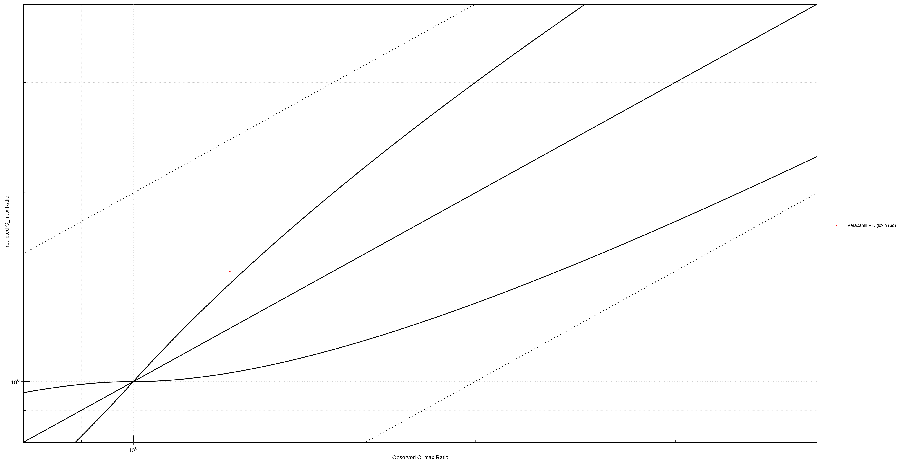
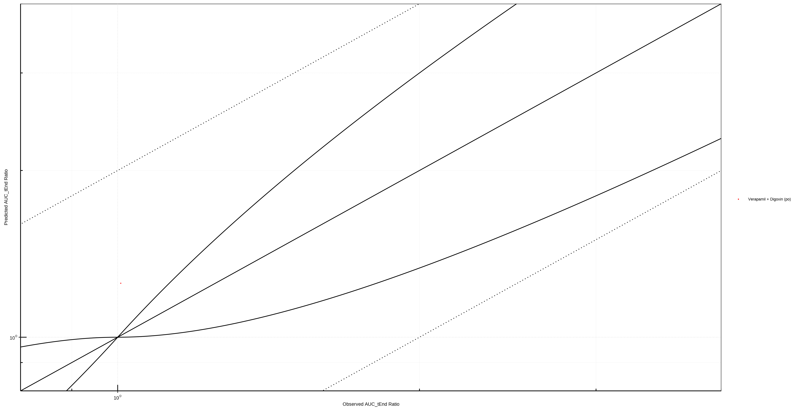
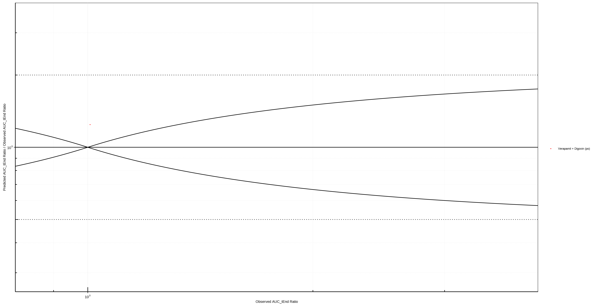
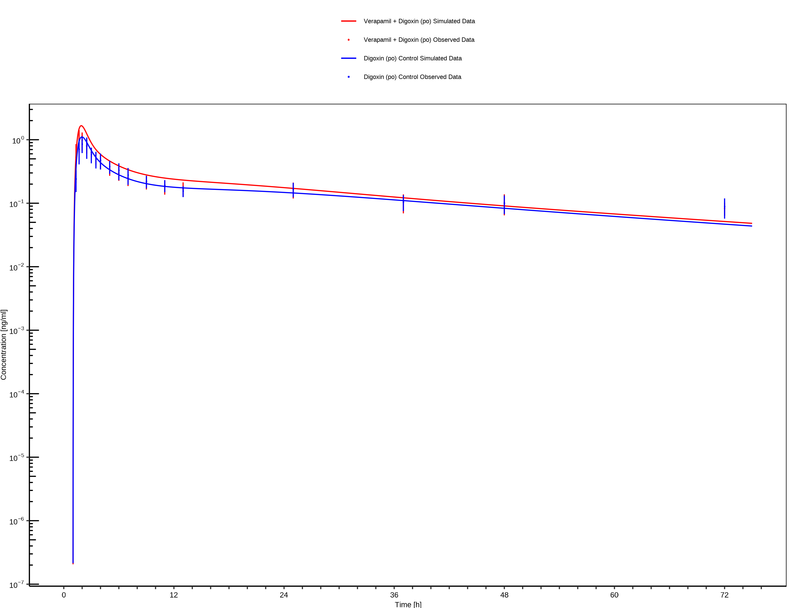

                   

# Table of Contents 

 * [1 Introduction](#introduction)
   * [1.1 Objective](#objective)
   * [1.2 Pgp DDI Network](#pgp-ddi-network)
     * [1.2.1 Verapamil - Digoxin DDI](#verapamil-digoxin-ddi)
 * [2 Qualification of Use Case Pgp-mediated DDI](#qualification-of-use-case-pgp-mediated-ddi)
   * [2.1 Mechanism](#qualification-of-use-case-pgp-mediated-ddi-ddi-subunit-9)
     * [2.1.1 Mechanism-based Inactivation](#qualification-of-use-case-pgp-mediated-ddi-ddi-subunit-10)
   * [2.2 Perpetrator](#qualification-of-use-case-pgp-mediated-ddi-ddi-subunit-18)
     * [2.2.1 Verapamil](#qualification-of-use-case-pgp-mediated-ddi-ddi-subunit-19)
   * [2.3 Victim](#qualification-of-use-case-pgp-mediated-ddi-ddi-subunit-27)
     * [2.3.1 Digoxin](#qualification-of-use-case-pgp-mediated-ddi-ddi-subunit-28)
 * [3 Concentration-Time Profiles](#concentration-time-profiles)
   * [3.1 Verapamil - Digoxin DDI](#verapamil-digoxin-ddi-timeprofile)
 * [4 References](#references)
 * [5 Appendix](#appendix)
   * [5.1 Open Systems Pharmacology Suite (OSPS) Introduction](#osp-introduction)
   * [5.2 Mathematical Implementation of Drug-Drug Interactions](#mathematical-implementation-of-ddi)
   * [5.3 Automatic (re)-qualification workflow](#aautomatic-requalification-workflow)

# 1 Introduction

                   

## 1.1 Objective

                   

## 1.2 Pgp DDI Network

                   

### 1.2.1 Verapamil - Digoxin DDI

                   

# 2 Qualification of Use Case Pgp-mediated DDI

                   

**Figure 2-1: Pgp DDI.  Predicted vs. Observed AUC_tEnd Ratio.**

 
 

**Figure 2-2: Pgp DDI.  Predicted/Observed vs. Observed AUC_tEnd Ratio.**

 
 

**Figure 2-3: Pgp DDI.  Predicted vs. Observed C_max Ratio.**

 
 

**Figure 2-4: Pgp DDI.  Predicted/Observed vs. Observed C_max Ratio.**

 
 

**Table 2-1: GMFE for Pgp DDI Ratio**

|PK parameter |GMFE |
|:------------|:----|
|AUC_tEnd     |1.24 |
|C_max        |1.23 |

 
 

**Table 2-2: Summary table for Pgp DDI - AUC_tEnd Ratio**

|AUC_tEnd                     |Number |Ratio [%] |
|:----------------------------|:------|:---------|
|Points total                 |2      |-        |
|Points within Guest *et al.* |0      |0         |
|Points within 2 fold         |2      |100       |

 
 

**Table 2-3: Summary table for Pgp DDI - C_max Ratio**

|C_max                        |Number |Ratio [%] |
|:----------------------------|:------|:---------|
|Points total                 |2      |-        |
|Points within Guest *et al.* |0      |0         |
|Points within 2 fold         |2      |100       |

 
 

**Table 2-4: Summary table for  Pgp DDI**

|DataID |Perpetrator               |Victim      |Predicted AUC_tEnd Ratio |Observed AUC_tEnd Ratio |Pred/Obs AUC_tEnd Ratio |Predicted C_max Ratio |Observed C_max Ratio |Pred/Obs C_max Ratio |Reference  |
|:------|:-------------------------|:-----------|:------------------------|:-----------------------|:-----------------------|:---------------------|:--------------------|:--------------------|:----------|
|16172  |Verapamil, 120 mg, PO, SD |Digoxin, PO |1.25                     |1.01                    |1.24                    |1.50                  |1.22                 |1.23                 |Wiebe 2020 |
|16172  |Verapamil, 120 mg, PO, SD |Digoxin, PO |1.25                     |1.01                    |1.24                    |1.50                  |1.22                 |1.23                 |Wiebe 2020 |
|16172  |Verapamil, 120 mg, PO, SD |Digoxin, PO |1.25                     |1.01                    |1.24                    |1.50                  |1.22                 |1.23                 |Wiebe 2020 |
|16172  |Verapamil, 120 mg, PO, SD |Digoxin, PO |1.25                     |1.01                    |1.24                    |1.50                  |1.22                 |1.23                 |Wiebe 2020 |

 
 

## 2.1 Mechanism

### 2.1.1 Mechanism-based Inactivation

**Figure 2-5: Pgp DDI. Mechanism: Mechanism-based Inactivation. Predicted vs. Observed AUC_tEnd Ratio.**

 
 

**Figure 2-6: Pgp DDI. Mechanism: Mechanism-based Inactivation. Predicted/Observed vs. Observed AUC_tEnd Ratio.**

 
 

**Figure 2-7: Pgp DDI. Mechanism: Mechanism-based Inactivation. Predicted vs. Observed C_max Ratio.**

 
 

**Figure 2-8: Pgp DDI. Mechanism: Mechanism-based Inactivation. Predicted/Observed vs. Observed C_max Ratio.**

 
 

**Table 2-5: GMFE for Pgp DDI Ratio**

|PK parameter |GMFE |
|:------------|:----|
|AUC_tEnd     |1.24 |
|C_max        |1.23 |

 
 

**Table 2-6: Summary table for Pgp DDI - AUC_tEnd Ratio**

|AUC_tEnd                     |Number |Ratio [%] |
|:----------------------------|:------|:---------|
|Points total                 |2      |-        |
|Points within Guest *et al.* |0      |0         |
|Points within 2 fold         |2      |100       |

 
 

**Table 2-7: Summary table for Pgp DDI - C_max Ratio**

|C_max                        |Number |Ratio [%] |
|:----------------------------|:------|:---------|
|Points total                 |2      |-        |
|Points within Guest *et al.* |0      |0         |
|Points within 2 fold         |2      |100       |

 
 

## 2.2 Perpetrator

### 2.2.1 Verapamil

**Figure 2-9: Pgp DDI. Perpetrator: Verapamil. Predicted vs. Observed AUC_tEnd Ratio.**

 
 

**Figure 2-10: Pgp DDI. Perpetrator: Verapamil. Predicted/Observed vs. Observed AUC_tEnd Ratio.**

 
 

**Figure 2-11: Pgp DDI. Perpetrator: Verapamil. Predicted vs. Observed C_max Ratio.**

 
 

**Figure 2-12: Pgp DDI. Perpetrator: Verapamil. Predicted/Observed vs. Observed C_max Ratio.**

 
 

**Table 2-8: GMFE for Pgp DDI Ratio**

|PK parameter |GMFE |
|:------------|:----|
|AUC_tEnd     |1.24 |
|C_max        |1.23 |

 
 

**Table 2-9: Summary table for Pgp DDI - AUC_tEnd Ratio**

|AUC_tEnd                     |Number |Ratio [%] |
|:----------------------------|:------|:---------|
|Points total                 |2      |-        |
|Points within Guest *et al.* |0      |0         |
|Points within 2 fold         |2      |100       |

 
 

**Table 2-10: Summary table for Pgp DDI - C_max Ratio**

|C_max                        |Number |Ratio [%] |
|:----------------------------|:------|:---------|
|Points total                 |2      |-        |
|Points within Guest *et al.* |0      |0         |
|Points within 2 fold         |2      |100       |

 
 

## 2.3 Victim

### 2.3.1 Digoxin

**Figure 2-13: Pgp DDI. Victim: Digoxin. Predicted vs. Observed AUC_tEnd Ratio.**

 
 

**Figure 2-14: Pgp DDI. Victim: Digoxin. Predicted/Observed vs. Observed AUC_tEnd Ratio.**

 
 

**Figure 2-15: Pgp DDI. Victim: Digoxin. Predicted vs. Observed C_max Ratio.**

 
 

**Figure 2-16: Pgp DDI. Victim: Digoxin. Predicted/Observed vs. Observed C_max Ratio.**

 
 

**Table 2-11: GMFE for Pgp DDI Ratio**

|PK parameter |GMFE |
|:------------|:----|
|AUC_tEnd     |1.24 |
|C_max        |1.23 |

 
 

**Table 2-12: Summary table for Pgp DDI - AUC_tEnd Ratio**

|AUC_tEnd                     |Number |Ratio [%] |
|:----------------------------|:------|:---------|
|Points total                 |2      |-        |
|Points within Guest *et al.* |0      |0         |
|Points within 2 fold         |2      |100       |

 
 

**Table 2-13: Summary table for Pgp DDI - C_max Ratio**

|C_max                        |Number |Ratio [%] |
|:----------------------------|:------|:---------|
|Points total                 |2      |-        |
|Points within Guest *et al.* |0      |0         |
|Points within 2 fold         |2      |100       |

 
 

# 3 Concentration-Time Profiles

                   

## 3.1 Verapamil - Digoxin DDI

                   

**Figure 3-1: Wiebe 2020 - plasma**

 
 

# 4 References

                   

# 5 Appendix

                   

## 5.1 Open Systems Pharmacology Suite (OSPS) Introduction

Open Systems Pharmacology Suite (OSP suite) is a tool for PBPK modeling and simulation of drugs in laboratory animals and humans. PK-Sim® and MoBi® are part of the OSP suite [[1](#references-for-osps-introduction)].  PK-Sim® is based on a generic PBPK-model with 18 organs and tissues. One of the main assumptions is that all compartments are well-stirred. Represented organs/tissues include arterial and venous blood, adipose tissue (separable adipose, excluding yellow marrow), brain, lung, bone (including yellow marrow), gonads, heart, kidneys, large intestine, liver, muscle, portal vein, pancreas, skin, small intestine, spleen and stomach, as shown in **Figure 1**.

Each organ consists of four sub-compartments namely the plasma, blood cells (which together build the vascular space), interstitial space, and cellular space. Distribution between the plasma and blood cells as well as between the interstitial and cellular compartments can be permeability-limited. In the brain, the permeation barrier is located between the vascular and the interstitial space. PK-Sim® estimates model parameters (intestinal permeability [[2](#references-for-osps-introduction)] organ partition coefficients (tissue-to-plasma partition coefficients) [[3,4](#references-for-osps-introduction)], and permeabilities) from physico-chemical properties of compounds (molecular weight, pKa, acid/base properties) and the composition of each tissue compartment (lipids, water and proteins). Partition coefficients can be calculated using a variety of methods available in PK-Sim®, for example the internal PK-Sim® method [[3,4](#references-for-osps-introduction)] or that of Rodgers and Rowland [[5-7](#references-for-osps-introduction)]. 

Physiological databases included in the software incorporate the dependencies of organ composition, organ weights, organ blood flows and gastrointestinal parameters (gastrointestinal length, radius of each section, intestinal surface area, gastrointestinal transit times, and pH in different intestinal segments [[2](#references-for-osps-introduction)]), with the user-defined body weight and height and ethnicity of the individual [[8](#references-for-osps-introduction)]. Thereby, PK Sim® allows generating realistic virtual populations. For a detailed description of the PBPK model structure implemented in PK Sim®, see Willmann et al. [[2,4,8,9](#references-for-osps-introduction)] or the OSP Suite homepage (<https://docs.open-systems-pharmacology.org/mechanistic-modeling-of-pharmacokinetics-and-dynamics/modeling-concepts>).

**Figure** **1: Structure of the Whole Body PBPK Model integrated in PK-Sim®**

## References for OSPS introduction

[1] [www.open-systems-pharmacology.org](http://www.open-systems-pharmacology.org/)

[2] [Willmann S, Schmitt W, Keldenich J, Lippert J, Dressman JB. A physiological model for the estimation of the fraction dose absorbed in humans.J Med Chem. 2004 Jul 29;47(16):4022-31.](https://www.ncbi.nlm.nih.gov/pubmed/15267240)

[3] [Haerter MW, K.J., Schmitt W, *Estimation of physicochemical and ADME parameters.* , in *Handbook of Combinatorial Chemistry: Drugs, Catalysts, Materials*, H.W. Nicolaou KC HR, Editor. 2002, Wiley VCH Verlag GmbH: Weinheim, Germany. p. 743-60.](https://onlinelibrary.wiley.com/doi/pdf/10.1002/3527603034.ch26)

[4] [Willmann S, Lippert J, Schmitt W. From physicochemistry to absorption and distribution: predictive mechanistic modelling and computational tools. Expert Opin Drug Metab Toxicol. 2005 Jun;1(1):159-68.](https://www.ncbi.nlm.nih.gov/pubmed/16922658)

[5] [Rodgers, T, D. Leahy, and M. Rowland. Physiologically based pharmacokinetic modeling 1: predicting the tissue distribution of moderate-to-strong bases. J Pharm Sci. 2005 Jun;94(6):1259-76.](https://www.ncbi.nlm.nih.gov/pubmed/15858854)

[6] [Rodgers T, Rowland M. Physiologically based pharmacokinetic modelling 2: predicting the tissue distribution of acids, very weak bases, neutrals and zwitterions. J Pharm Sci. 2006 Jun;95(6):1238-57.](https://www.ncbi.nlm.nih.gov/pubmed/16639716)

[7] [Rodgers T, Rowland M. Mechanistic approaches to volume of distribution predictions: understanding the processes. Pharm Res. 2007 May;24(5):918-33.](https://www.ncbi.nlm.nih.gov/pubmed/17372687)

[8] [Willmann S, Höhn K, Edginton A, Sevestre M, Solodenko J, Weiss W, Lippert J, Schmitt W. Development of a physiology-based whole-body population model for assessing the influence of individual variability on the pharmacokinetics of drugs. J Pharmacokinet Pharmacodyn. 2007 Jun;34(3):401-31.](https://www.ncbi.nlm.nih.gov/pubmed/17431751)

[9] [Willmann S, Lippert J, Sevestre M, Solodenko J, Fois F, Schmitt W. PK-Sim®: a physiologically based pharmacokinetic ‘whole-body’ model. Biosilico 2003.1(4):121-24.](https://www.sciencedirect.com/science/article/pii/S1478538203023424?via%3Dihub)

## 5.2 Mathematical Implementation of Drug-Drug Interactions

**DDI modeling: Competitive inhibition** 

A detailed representation of the mathematical implementation of competitive enzyme inhibition  can be found in the OSP manual [here](https://docs.open-systems-pharmacology.org/working-with-pk-sim/pk-sim-documentation/pk-sim-compounds-defining-inhibition-induction-processes#competitive-inhibition-simple-setting-with-one-inhibitor).

**DDI modeling: Mechanism-based inhibition**

A detailed representation of the mathematical implementation of mechanism-based enzyme inhibition  can be found in the OSP manual [here](https://docs.open-systems-pharmacology.org/working-with-pk-sim/pk-sim-documentation/pk-sim-compounds-defining-inhibition-induction-processes#irreversible-inhibition).

**DDI modeling: Induction**

A detailed representation of the mathematical implementation of enzyme induction can be found in the OSP manual [here](https://docs.open-systems-pharmacology.org/working-with-pk-sim/pk-sim-documentation/pk-sim-compounds-defining-inhibition-induction-processes#enzyme-induction).

## 5.3 Automatic (re)-qualification workflow

[Open Systems Pharmacology](http://www.open-systems-pharmacology.org) provides a dynamic landscape of model repositories and a database of observed clinical data. Additionally, a technical framework to assess confidence of a specific intended use has been developed (qualification runner and reporting engine). This framework allows for an automatic (re)-qualification workflow of the OSP suite, comprising the following steps (**Figure 1**):

- PBPK model development and verification with observed data,

- Qualification plan generation,

- Qualification plan execution,

- Qualification report generation.

  

**Figure 1: OSP suite automatic (re)-qualification workflow**

In a first step, the respective qualification scenario is saved in a special qualification repository on [GitHub](https://github.com/Open-Systems-Pharmacology/). This qualification scenario repository contains a detailed qualification plan that links and combines respective models and data to address the use case that shall be qualified. Therefore, the qualification plan consists of: 

- PK-Sim project files,
- Additional model building steps (if applicable),
- Description of potential cross-dependencies between PK-Sim project files (if applicable),
- Observed data (needed for model development and verification),
- Qualification scenario description text modules
- Detailed report settings to describe the generation of charts and qualification measures. 

PK-Sim projects, observed data sets, and qualification scenario text modules are deposited in distinct repositories and are referenced by the qualification plan (**Figure 2**).

**Figure 2: Qualification scenario repository landscape on GitHub**

In a second step the [qualification runner](https://github.com/Open-Systems-Pharmacology/QualificationRunner) processes the qualification plan, i.e. all project parts are exported and prepared for the [reporting engine](https://github.com/Open-Systems-Pharmacology/Reporting-Engine). The reporting engine provides a validated environment (currently implemented in MATLAB®, a transfer to R is in development) for model execution and finally generates the qualification report. This report contains the evaluation of the individual PBPK models with observed data (i.e. standard goodness of fit plots, visual predictive checks) and a comprehensive qualification of the specific use case assessing the predictive performance of the OSP suite by means of a predefined set of qualification measures and charts. 

The automated execution of the described workflow can be triggered to assess re-qualification in case new data, changes in model structure or parameterization, or new OSP suite releases arise.

